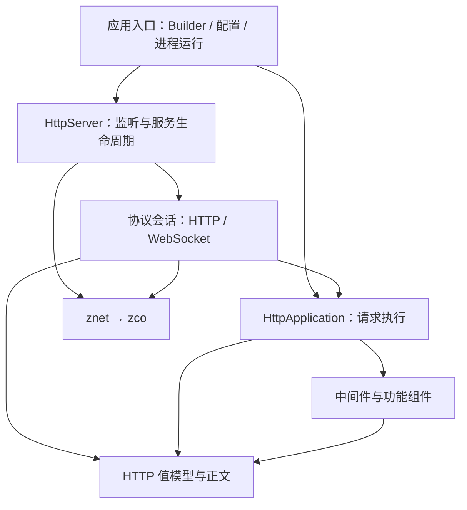

# zhttp 架构审查报告

> 本文记录重构前的审查与建议。实施状态、实际 API 和验证结果见 [重构实施报告](refactoring-report.md)。源码链接已随目录迁移更新。

审查日期：2026-10-09。目标语言标准：C++17。

本文保留实施前的审查与方案。审查依据为当时 zhttp 的生产代码、公共接口、构建配置、测试结构，以及沿调用链对 znet、zco、zlog 的核对。审查阶段没有修改代码，没有编译或运行测试；当时涉及运行时故障的判断单独标注为待复现。后续实施和验证以重构实施报告为准。

## 1. 评审结论

zhttp 已具备合理的协议分解，适合在现有基础上重构。最需要调整的是请求处理、网络运行、进程控制和日志之间的边界。不建议整体重写解析器、路由器，或套用完整的 DDD、Clean Architecture。

当前约有 89 个生产头文件和实现文件，共 11,441 行，包括注释。最大实现文件为 431 行，未发现明显的巨型 Server 或深层继承体系。源码中有 31 个测试文件、374 个测试定义；这些数量不代表本轮验证通过。

建议以“请求处理核心＋协议会话＋服务运行入口”为主要结构，保留现有状态机和扩展机制，不通过增加通用 Manager、Factory 或接口继承层制造架构复杂度。

## 2. 现有架构

### 2.1 核心目标和依赖

项目提供基于协程的 HTTP/HTTPS、WebSocket 框架，组织路由、中间件、正文解析和响应发送。它没有独立的业务领域层，业务逻辑由使用方提供的回调承担。

```text
zhttp
  → znet → zco
  → zlog
  → OpenSSL / ZLIB / Brotli / nlohmann_json / TOML

zmalloc：根工程可选的全局分配器策略，不属于 HTTP 业务抽象。
```

源码包含关系检查未发现 zhttp 内部头文件循环，也未发现 znet、zco、zlog、zmalloc 反向包含 zhttp。需要解决的是局部职责交叉，而不是不存在的顶层循环依赖。此检查针对源码包含关系，不等于对所有运行时关系作形式化证明。

### 2.2 启动流程

```text
HttpServerBuilder
  → 加载并校验 ServerConfig
  → 初始化全局 zhttp 日志
  → 解析监听地址
  → 构造 HttpServer，同时创建 zco::Runtime 和工作线程
  → 加载 TLS 凭据
  → 注册中间件和路由

start()
  → 冻结配置
  → 创建 TcpServer
  → 接受连接
  → 为每个连接创建协议状态

run()
  → 通过 Daemon 执行上述构造流程
  → 等待停止信号
  → stop()
```

`build()` 不启动监听，但会创建 Runtime 工作线程。`run()` 将服务器构造放在 Daemon 的执行回调内，然而配置加载、日志初始化及监督进程日志仍需要核对 fork 前后的时机。

### 2.3 数据流和控制流

HTTP 请求：

```text
TCP/TLS
  → ByteBuffer
  → HttpRequestParser / ChunkedDecoder
  → HttpRequest
  → HttpContext
  → Router 匹配
  → Middleware.before
  → 业务处理器
  → Middleware.after
  → 响应边界计算
  → 发送头部和正文
  → 完成通知
```

WebSocket 升级：

```text
业务提出升级意图
  → 校验握手
  → 创建候选协议对象
  → 完整发送 101
  → HTTP 回调返回
  → 替换协议对象
  → 继续消费缓冲区中的 WebSocket 帧
```

延迟替换避免了在回调执行期间销毁当前协议对象，应保留。原 `HttpServer` 中的 `ConnectionState::drive()` 已迁入 [connection_session.cc](../src/protocol/connection_session.cc)。

中间件 before 按选择顺序执行，已正常返回 before 的中间件逆序执行 after。业务异常和 after 异常经 Pipeline 转换为响应；单个 after 的失败不阻止其他中间件收尾。

### 2.4 生命周期和资源所有权

| 对象 | 当前所有权与生命周期 |
|---|---|
| `HttpServer` | 唯一拥有 IO Runtime 和 TcpServer |
| `HttpServer::Runtime` | 被服务器与会话工厂共享，混合保存请求处理和网络配置 |
| `ConnectionState` | 由消息、关闭回调共同持有 |
| 协议处理器 | 由 ConnectionState 唯一拥有 |
| `HttpContext` | 每次请求在栈上创建，拥有响应及派生缓存 |
| `HttpRequest` | 共享只读请求，必要时可以延长其寿命 |
| `HttpBody` | 移动式所有权，文件描述符由 RAII 释放 |
| `WebSocketConnection` | 弱引用底层连接，避免所有权环 |
| 路由处理器、中间件 | 实例共享，不同连接可能并发调用 |
| `SessionManager` | 实例拥有进程内存存储；请求获得独立 Session 数据 |

这些位置不能统一替换成某一种智能指针：会话回调、冻结的 Application 和只读请求存在真实共享需求；协议对象、文件资源和 Runtime 的唯一所有权应继续明确。

### 2.5 线程、异步、错误及基础设施

| 方面 | 当前行为 |
|---|---|
| 线程与异步 | 协程内部同步处理；同一连接依次解析、执行业务和发送，网络等待可以挂起协程 |
| 阻塞操作 | 同步文件读取、压缩及阻塞业务代码会占用工作线程 |
| 接收超时 | 请求首字节起的总读取期限与网络读取、空闲期限分别配置 |
| 业务超时 | TimeoutMiddleware 在业务返回后检查耗时，没有抢占或取消能力 |
| 错误传播 | 解析状态、异常、bool、WriteResult 和底层 Result 并存；部分网络错误被压缩为 bool 或全局日志 |
| 配置 | ServerConfig 汇总启动输入，TOML 加载与校验会记录全局日志 |
| 日志 | zhttp 使用全局 ModuleLogger；Builder 构建会替换日志实例和级别 |
| 网络 | znet 持有 TCP/TLS 传输资源；zhttp 会话持有协议状态 |
| 存储 | Session 为进程内存存储；上传文件保存和静态资源访问使用文件系统，无数据库层 |
| 公共基础设施 | 字符串、HTTP 字段、MIME、路径、文件和 Range 操作分布在 common、internal 中 |
| 对外 API | 安装清单已经排除 Parser、Pipeline、Writer 和协议处理器，但部分内部控制操作仍公开 |
| 测试 | 既有纯模型测试，也有 socketpair、真实 TCP/TLS/WebSocket 和进程测试；测试支持头混合了多层依赖 |

## 3. 主要架构问题

| 优先级 | 已确认的问题 | 实际影响 | 建议 |
|---|---|---|---|
| 高 | 请求执行入口依附 HttpServer | 离线处理也需要构造网络服务器与工作线程；测试另造 TestApplication 拼装 Router、Pipeline | 提取可独立使用的 HttpApplication |
| 高 | build() 修改全局日志状态 | 构建多个服务器会互相影响日志级别和日志实例 | 实例拥有日志，运行边界注入错误回调 |
| 高 | 服务生命周期接口不完整 | 底层要求回调使用 request_stop()，HttpServer 却只公开会等待任务的 stop() | 增加明确的非阻塞停止请求接口 |
| 高 | 进程控制缺少作用域边界 | Daemon 修改全进程信号处理器，退出后没有恢复；停止状态由全局变量保存 | 限制在运行入口，明确独占使用契约并恢复信号处理器 |
| 中 | HTTP 编码与网络写出混合 | 响应格式测试需要接触 Connection；WebSocket 发送依赖 HTTP writer 的发送工具函数 | 分开响应编码与正文发送，移除跨协议工具依赖 |
| 中 | 静态文件中间件承担多个职责 | 路径映射、磁盘访问、编码选择、缓存、条件请求、Range 和响应构造相互交织 | 提取一个内部静态资源存储组件，HTTP 策略保留在中间件 |
| 中 | 请求计时状态放在共享中间件中 | 通过 Context 地址索引时间栈，需要共享互斥并依赖 before/after 配对 | 状态放入本次请求作用域，保持重复注册语义 |
| 中 | 限流算法与 HTTP 适配同文件 | 纯限流策略被迫依赖完整 HttpContext，不容易独立消费 | 分离限流策略与 HTTP 中间件 |
| 中 | 部分内部控制接口公开 | 使用方可以提前提交响应、改变 WebSocket 内部状态或接管升级意图 | 收紧框架内部生命周期操作 |
| 中 | 状态容器缺少总量边界 | 静态缓存只限制单文件大小，限流键记录没有淘汰机制 | 明确容量、过期和清理策略 |

主要证据：

- [http_server.cc](../src/runtime/http_server.cc)：构造即创建 Runtime；离线 handle() 直接执行 Pipeline。
- [http_server_builder.cc](../src/runtime/http_server_builder.cc)、[server_bootstrap.cc](../src/runtime/server_bootstrap.cc)：构建时调用全局日志初始化。
- 原 `tests/test_support.h`：TestApplication 继承 Router，再自行组合 Pipeline。该重复执行入口已删除，新测试输入辅助见 [request_builder.h](../tests/support/request_builder.h)。
- [websocket_connection.cc](../src/protocol/websocket/websocket_connection.cc)：通过 HTTP writer 中的 send_all_or_fail() 发送帧。
- [timeout_middleware.cc](../src/middleware/timeout_middleware.cc)：共享实例保存请求地址对应的计时栈。
- [static_file_middleware.cc](../src/middleware/static_file_middleware.cc)：缓存命中后，在缓存锁内构造响应和复制正文。

静态文件缓存应取得资源快照后释放锁，再执行 HTTP 策略。限流记录清理需要依据算法的有效时间窗口，不能简单淘汰仍有效的记录，否则会重置限流额度。

`internal/radix_tree.h` 使用 shared_ptr 表示树节点，但当前结构没有显示出节点共享所有权需求。父节点唯一拥有子节点、遍历使用非拥有指针或引用，会更准确地表达所有权。

## 4. 核心类的保留与调整

| 核心组件 | 一句话职责 | 处理意见 |
|---|---|---|
| HttpRequest、HttpHeaders、Uri | 描述请求协议值 | 保留；请求正文可简化为内存字符串 |
| HttpResponse、HttpBody | 描述响应及其正文资源 | 保留移动所有权与 RAII |
| HttpContext | 承载一次请求处理的数据、结果和收尾通知 | 保留，不扩展成服务定位器 |
| Router | 根据方法和路径匹配处理器 | 保留，不承担执行链 |
| RequestPipeline | 选择和执行中间件、处理业务异常 | 保留为 Application 的内部组成部分 |
| HttpRequestParser、ChunkedDecoder | 保存增量请求解析状态 | 保留独立状态机 |
| ProtocolHandler | 统一 HTTP、WebSocket 的连接协议生命周期 | 保留，已有两个真实实现 |
| HttpProtocolHandler | 驱动连接上的 HTTP 请求处理及升级 | 保留为内部会话，减少构造参数和具体执行组件依赖 |
| WebSocketProtocolHandler | 驱动帧处理、控制帧响应和生命周期通知 | 保留，帧解析和消息组装继续独立 |
| WebSocketMessageAssembler | 保存分片消息的跨帧状态 | 保留，虽小但职责独立 |
| Middleware、RouteHandler | 提供真实的业务扩展入口 | 保留浅层继承 |
| SessionManager | 保存带过期时间的内存会话记录 | 保留，不因 Manager 名称而强拆 |
| HttpServerBuilder | 收集配置并组装服务 | 保留，移除隐式全局副作用 |
| HttpServer | 管理 HTTP 监听服务的生命周期 | 将请求执行能力归入 Application |

HttpContext 中的路径参数、Cookie、正文缓存和会话绑定均属于请求处理，不应仅为了缩小类而拆成大量包装对象。

HttpBody::file() 和 UploadedFile::save_to() 是明确表达 IO 行为的便利入口，当前没有必要仅为追求“纯模型”而删除。

最大文件的行数本身不是拆分依据。http_common.cc 的大量协议映射代码不构成 God Class；优先调整真实耦合，不以缩短文件为主要目标。

## 5. 待复现的行为风险

以下均有源码依据，但本轮没有做运行复现。行为修正应与纯架构迁移区分，先建立回归测试，不能偷偷改变既有契约。

| 当前行为或触发条件 | 风险判断 | 推荐行为 |
|---|---|---|
| from_toml() 会记录日志；日志初始化创建异步线程；Daemon 随后 fork | fork 前可能已存在日志线程，监督进程重启路径也可能再次触发此问题 | fork 前不启动异步日志和 Runtime；监督进程避免使用异步日志 |
| run_server() 只等待停止信号 | 即使监听任务终止，运行入口仍可能继续等待 | 同时观察服务运行状态，异常停止应返回失败 |
| 路由先注册 /users/:id，再注册同形路径 /users/:name | 参数名保存在共享参数节点上，后注册路由可能得到前一个名称 | 参数名称归属于具体路由记录，树节点只描述匹配结构 |
| RateLimiterMiddleware 默认回调捕获 this，类仍可复制 | 复制后回调保留原对象地址，原对象销毁后存在悬空关系 | 默认键提取改为不捕获实例的普通函数 |
| 配置中未知栈模式静默变为 independent | 配置拼写错误被隐藏，且现有测试固定了此行为 | 如修改，应作为显式配置行为变更，并更新测试 |

证据：[运行循环](../src/runtime/server_runner.cc)、[动态路由节点复用](../src/router/radix_tree.cc)、[限流回调捕获](../src/middleware/rate_limiter_middleware.cc)、[配置加载](../src/config/server_config.cc)、[异步日志初始化](../../zlog/src/module_logger.cc)。

静态路径校验目前主要拒绝词法上的 `..`，文件操作会跟随符号链接。需要明确 document_root 是资源定位根还是安全边界，才能判断是否需要更严格的文件访问契约。

## 6. 建议架构

### 6.1 模块边界与依赖方向



| 模块 | 职责与允许依赖 |
|---|---|
| 请求模型 | 请求、响应、头部、URI、正文；不依赖 Server、Router、运行入口 |
| Application | 组合 Router 与 Pipeline，执行请求；不依赖 TCP、Runtime、全局日志 |
| 功能组件 | 中间件、限流、Session、静态资源；各自管理必要状态 |
| 协议会话 | 增量解析、响应发送、Keep-Alive、升级、连接关闭；调用 Application 和 znet |
| 服务运行 | 监听、TLS、Runtime 所有权、停止与等待；不实现路由或中间件规则 |
| 应用入口 | TOML、日志适配、信号、守护进程、组装对象 |

明确禁止：

- Application 调用 HttpServer 或查找全局 Runtime。
- Router 执行网络发送或管理连接。
- WebSocket 发送依赖 HTTP 响应 writer。
- 协议解析器修改业务路由。
- 配置解析和普通请求处理隐式初始化全局日志。
- 中间件保存借用的 Context 地址作为长期请求状态。

不新增通用 ContextManager、ServiceFactory、IFileSystem 或日志继承体系。静态资源部分只提取一个有真实存储和缓存职责的内部组件。

建议提供可独立构建、测试的 zhttp::core 目标，包含请求模型、Application、路由和必要的请求处理逻辑；现有 zhttp::zhttp 保持完整框架入口。纯请求处理测试应能不链接 znet、zco、zlog。core 目标的独立性指没有网络运行时和全局日志依赖，并不要求删除明确的文件正文便利入口。

### 6.2 核心接口

建议新增 HttpApplication，拥有 Router、Pipeline 和请求处理配置：

```cpp
class HttpApplication {
public:
    Router& router();

    void use(mid::Middleware::ptr);
    void use(const std::string& path, mid::Middleware::ptr);
    void use_group(const std::string& prefix, mid::Middleware::ptr);

    void set_not_found_handler(HttpHandler);
    void set_exception_handler(ExceptionHandler);

    void freeze();
    bool handle(HttpContext&) const;
};
```

这是现有请求能力的真实归属，不是新增转发层。测试直接使用它，删除测试专用的 Application 拼装实现。配置必须在并发处理前冻结；freeze() 冻结注册表，不意味着用户回调中的状态自动线程安全。

HttpServer 支持借用外部 Runtime，并保留现有拥有 Runtime 的构造方式。拥有型 Runtime 可以延迟到启动时创建，避免单纯配置服务就启动线程。

### 6.3 所有权、控制流和数据流

```text
应用入口
  ├─ 拥有 Runtime
  ├─ 拥有 HttpServer
  └─ 持有 HttpApplication

HttpServer / 会话工厂
  └─ 持有冻结后的 HttpApplication

会话回调
  └─ 共享持有连接协议状态
       └─ 唯一拥有当前协议对象
```

多个监听器可以共享同一个 Application 或 Runtime，因此这些位置的共享、借用关系有实际意义。借用 Runtime 必须明确由应用保证其存活至所有服务器停止之后。

```text
启动：组装 Application → 冻结注册 → 启动监听 → 创建连接会话
请求：输入 → 增量解析 → Application → 响应编码 → 正文发送 → 完成通知
升级：升级意图 → 握手 → 写出 101 → 回调返回 → 交接协议
停止：连接回调 request_stop() → 控制线程 stop() → 等待会话结束
销毁：服务器 → Runtime
```

保留同步响应发送、请求读取总期限和完成回调语义。完成通知表示写出结果，不能在 Application 刚返回时就误报为发送完成。

编程契约错误继续用异常；网络启动和 TLS 初始化等可预期失败返回带原因的结果。解析状态机保留协议专属结果，不为统一形式而强行引入万能错误体系。

## 7. API 迁移清单（建议，尚未实施）

| 类别 | 建议 |
|---|---|
| 新增 | HttpApplication、HttpServer 借用 Runtime 的构造方式、request_stop() |
| 修改 | HttpServer::start()、TLS 配置接口返回包含错误原因的结果 |
| 收紧 | HttpResponse::commit()、WebSocketConnection::mark_closed()、HttpContext::take_upgrade() |
| 删除全局依赖入口 | init_logger()、get_logger_ptr()、should_log()、ZHTTP_LOG_*，改为实例日志适配和错误回调 |
| 候选删除 | 无仓库调用者的 HttpRequest::body_source()；请求只保存内存正文 |
| 保留 | 路由回调签名、中间件 before/after、HttpBody、WebSocket 回调、TOML 节名、Builder 链式入口 |
| 命名空间 | 保留公共 zhttp、zhttp::mid；内部实现归入 zhttp::detail |

HttpContext::complete() 不能仅因为属于生命周期操作就直接隐藏：离线处理方可能需要显式报告最终完成结果，应先明确这个使用契约。

没有理由强制把 Builder 的返回值从 shared_ptr 改为 unique_ptr。当前 HttpServer 已能放在栈上，也没有要求 shared_from_this()；单纯改变返回类型收益有限。

现有 Server 注册方法可以作为便利入口保留，离线调用方迁移到 Application。保留这些便利方法不会影响核心独立性，无需为此强行破坏兼容。

## 8. 建议目录及文件迁移

公共头文件移入 include/zhttp/，继续保留合理的包含路径；实现和未公开接口进入 src/。以下是建议的 zhttp 模块布局，`.{h,cc}` 表示两个文件，其他仓库模块保持现状。

```text
zhttp/
├── CMakeLists.txt
├── README.md
├── include/zhttp/
│   ├── zhttp.h
│   ├── http_application.h
│   ├── http_body.h
│   ├── http_common.h
│   ├── http_context.h
│   ├── http_headers.h
│   ├── http_request.h
│   ├── http_response.h
│   ├── http_server.h
│   ├── http_server_builder.h
│   ├── request_limits.h
│   ├── server_config.h
│   ├── session.h
│   ├── uri.h
│   ├── rate_limiter.h
│   ├── detail/
│   │   └── parsed_request_body.h
│   ├── content/
│   │   └── multipart.h
│   ├── router/
│   │   ├── router.h
│   │   └── route_handler.h
│   ├── middleware/
│   │   ├── middleware.h
│   │   ├── auth_middleware.h
│   │   ├── compression_middleware.h
│   │   ├── cors_middleware.h
│   │   ├── error_middleware.h
│   │   ├── rate_limiter_middleware.h
│   │   ├── request_body_middleware.h
│   │   ├── security_middleware.h
│   │   ├── session_middleware.h
│   │   ├── static_file_middleware.h
│   │   └── timeout_middleware.h
│   ├── runtime/
│   │   └── daemon.h
│   └── websocket/
│       ├── websocket_connection.h
│       ├── websocket_handler.h
│       └── websocket_types.h
├── src/
│   ├── application/
│   │   ├── http_application.cc
│   │   └── request_pipeline.{h,cc}
│   ├── message/
│   │   ├── http_body.cc
│   │   ├── http_common.cc
│   │   ├── http_context.cc
│   │   ├── http_headers.cc
│   │   ├── http_request.cc
│   │   ├── http_response.cc
│   │   └── uri.cc
│   ├── content/
│   │   ├── multipart.cc
│   │   └── parsed_request_body.cc
│   ├── router/
│   │   ├── router.cc
│   │   └── radix_tree.{h,cc}
│   ├── middleware/
│   │   ├── auth_middleware.cc
│   │   ├── compression_middleware.cc
│   │   ├── cors_middleware.cc
│   │   ├── error_middleware.cc
│   │   ├── rate_limiter_middleware.cc
│   │   ├── request_body_middleware.cc
│   │   ├── security_middleware.cc
│   │   ├── session_middleware.cc
│   │   ├── static_file_middleware.cc
│   │   └── timeout_middleware.cc
│   ├── rate_limit/
│   │   └── rate_limiter.cc
│   ├── static_files/
│   │   ├── static_resource_store.{h,cc}
│   │   ├── path.{h,cc}
│   │   └── range.{h,cc}
│   ├── session/
│   │   └── session.cc
│   ├── protocol/
│   │   ├── connection_session.{h,cc}
│   │   ├── protocol_handler.h
│   │   ├── http/
│   │   │   ├── http_protocol_handler.{h,cc}
│   │   │   ├── http_request_parser.{h,cc}
│   │   │   ├── chunked_decoder.cc
│   │   │   ├── response_encoder.{h,cc}
│   │   │   └── http_response_writer.{h,cc}
│   │   └── websocket/
│   │       ├── websocket_protocol_handler.{h,cc}
│   │       ├── websocket_connection.cc
│   │       ├── websocket_frame.{h,cc}
│   │       ├── websocket_frame_parser.{h,cc}
│   │       ├── websocket_handshake.{h,cc}
│   │       └── websocket_message_assembler.{h,cc}
│   ├── config/
│   │   └── server_config.cc
│   └── runtime/
│       ├── http_server.cc
│       ├── http_server_builder.cc
│       ├── server_runtime.h
│       ├── server_bootstrap.cc
│       ├── server_runner.cc
│       ├── daemon.cc
│       └── logging.{h,cc}
├── docs/
│   └── architecture-review.md
└── tests/
    ├── CMakeLists.txt
    ├── support/
    │   ├── request_builder.h
    │   └── network_fixture.h
    ├── unit/
    │   ├── auth_middleware_test.cc
    │   ├── compression_middleware_test.cc
    │   ├── cors_middleware_test.cc
    │   ├── daemon_test.cc
    │   ├── error_middleware_test.cc
    │   ├── http_application_test.cc
    │   ├── http_common_test.cc
    │   ├── http_parser_test.cc
    │   ├── http_request_test.cc
    │   ├── http_response_test.cc
    │   ├── http_server_builder_test.cc
    │   ├── http_server_context_test.cc
    │   ├── http_utils_test.cc
    │   ├── middleware_test.cc
    │   ├── multipart_test.cc
    │   ├── range_parse_test.cc
    │   ├── rate_limiter_test.cc
    │   ├── regex_prefix_bucket_test.cc
    │   ├── request_body_middleware_test.cc
    │   ├── request_components_test.cc
    │   ├── router_detailed_test.cc
    │   ├── router_test.cc
    │   ├── security_middleware_test.cc
    │   ├── server_config_test.cc
    │   ├── session_test.cc
    │   ├── static_file_opt_test.cc
    │   ├── static_resource_store_test.cc
    │   ├── timeout_middleware_test.cc
    │   ├── websocket_frame_test.cc
    │   ├── websocket_handshake_test.cc
    │   └── logging_test.cc
    ├── integration/
    │   ├── http_server_test.cc
    │   └── websocket_server_test.cc
    └── benchmark/
        ├── zhttp_benchmark.cc
        └── zhttp_wrk_perf.sh
```

主要迁移对应关系：

| 旧位置 | 建议位置或归属 |
|---|---|
| 根目录请求、响应实现 | src/message/ |
| HttpServer 中的 Router、Pipeline | HttpApplication |
| HttpServer 中的 ConnectionState | src/protocol/connection_session.* |
| pipeline/ | src/application/ |
| parser/、protocol/、writer/ | 按 HTTP、WebSocket 归入协议目录 |
| internal/radix_tree.* | src/router/ |
| internal/http_utils.* | 路径与资源操作归入静态资源；上传保存保留在上传功能 |
| internal/range_parse.* | src/static_files/range.* |
| 限流中间件中的算法 | src/rate_limit/rate_limiter.cc |
| zhttp_logger.* | 实例日志适配 src/runtime/logging.* |
| content/parsed_request_body.h | include/zhttp/detail/，作为支持声明而非业务 API |
| 测试专用 Application、Context 继承包装 | 真实 Application 与请求构造辅助函数 |

这些是建议目标，不是已经产生的文件变更。目录迁移后需要同步更新本报告的源码链接。

## 9. 实施顺序与验收

1. 补齐风险复现，建立行为基线：动态路由参数、停止请求、监听异常退出、fork 与日志。
2. 提取 HttpApplication，迁移离线调用和测试，建立不依赖网络运行时的核心目标。
3. 调整 Runtime 所有权、停止接口、日志及进程运行边界。
4. 分离响应编码与发送，移除 WebSocket 对 HTTP writer 的依赖。
5. 提取静态资源存储、限流策略，调整请求计时状态归属。
6. 最后迁移目录、收紧内部 API、删除旧实现和测试包装。

每个主要阶段均应在 C++17 下编译并运行现有测试，修复失败后再继续。重点补充共享 Runtime、多监听器共享 Application、停止与重启、错误传播、缓存清理，以及同步流和升级后的缓冲区继续处理。

验收条件：

- 离线请求处理不创建监听器、Runtime 工作线程或全局日志。
- Application 和限流策略能通过生产接口独立测试。
- 核心目标不链接 znet、zco、zlog；完整框架目标继续正常消费和安装。
- 回调发起停止不等待自身，控制线程等待所有会话完成。
- 保持现有中间件顺序、HTTP framing、Keep-Alive、同步流和协议交接行为。
- 所有权、配置冻结时机、错误接收位置具有明确契约。
- 迁移完成后没有 Old/New/V2 实现、过渡适配层或孤儿接口。
- 新开发者能根据模块职责判断功能放置位置、允许依赖和修改影响范围。

本轮仅完成静态架构审查与方案整理。没有运行测试或重新生成覆盖率，现有 coverage summary 不能作为此次方案的验证证据。
