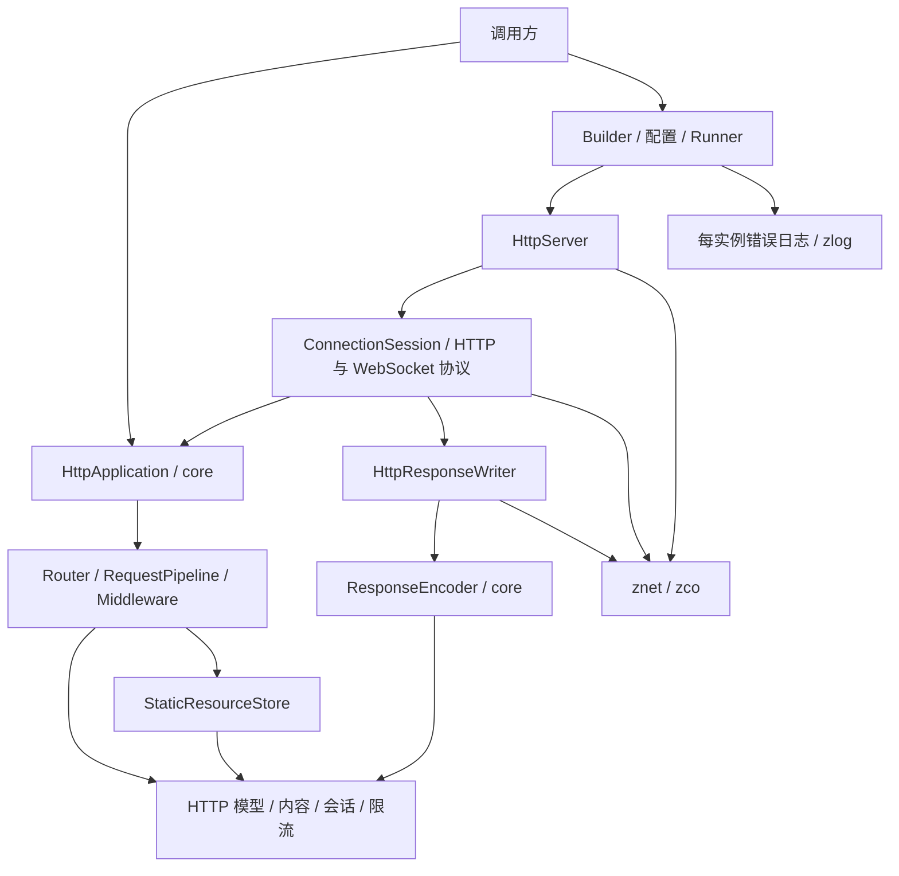

# zhttp 架构重构实施报告

本轮已完成代码迁移、调用方更新、编译、测试和安装消费验证，使用 C++17。修改范围限于 `zhttp/`，未修改 znet、zco、zlog、zmalloc 的实现。原始审查保留在 [architecture-review.md](architecture-review.md)。

## 1. 解决的主要问题

| 原问题 | 实际调整及收益 |
|---|---|
| HttpServer 同时组合应用执行、连接协议与 Runtime，构造时启动工作线程 | 新增 HttpApplication；HttpServer 只管理监听配置及生命周期；连接协议交接移入私有 ConnectionSession；自有 Runtime 延迟到首次 start() 创建 |
| 离线测试用 TestApplication 重新实现生产执行入口 | 删除 TestApplication，路由和中间件测试直接执行生产 HttpApplication；23 个测试程序只链接 core |
| 全局日志初始化侵入配置、路由、流水线和进程控制 | 删除全局日志接口；配置及核心处理无日志初始化副作用；错误在边界返回或交给每监听器的错误回调 |
| 静态文件中间件混合 HTTP 决策、磁盘操作及缓存 | HTTP 策略留在中间件；文件选择、元信息、读取、RAII 文件正文和有界缓存归 StaticResourceStore |
| Writer 混合纯编码与网络发送，WebSocket 借用 HTTP 发送工具 | 拆出 ResponseEncoder；Writer 只负责响应提交和网络写出；WebSocket 直接调用连接发送接口 |
| 路由节点保存路由特有参数名，结构共享导致语义串线 | 树节点只表达路径结构；参数名、模式和处理器属于具体方法的路由记录；树由 unique_ptr 唯一拥有 |
| TimeoutMiddleware 用请求地址维护共享计时表 | 计时记录归当前 Context 所有；取消和析构自然清理，无跨请求地址关联和共享计时锁 |
| 限流算法与 HTTP 适配混在同一模块，历史 key 永久驻留 | 提取独立算法头文件和实现；按算法安全过期条件清理 key，不重置仍有效的配额 |
| 私有头文件与公共 API 混在源码根目录 | 公共头文件集中到 include/zhttp，私有头文件归 src；安装不暴露 Parser、Pipeline、Writer、协议或资源存储实现 |

没有引入新的 Manager、通用 Context、抽象存储接口或多层工厂。现有 Middleware、ProtocolHandler、RateLimiter、SessionStore 具有多个实际实现或实际替换需求，保留其抽象；Builder 保留配置装配和便捷调用职责。

## 2. 新模块与依赖

`zhttp::core` 提供可离线执行的应用、HTTP 模型、路由、中间件、内容解析、限流、会话、静态资源及纯响应编码。它不链接 znet、zco、zlog。它包含真实文件存储及压缩实现，并不宣称全部都是纯函数。

`zhttp::zhttp` 在 core 上增加 HTTP/WebSocket 连接协议、网络发送、监听器、配置装配和进程运行。二者是同一份实现的两组构建目标，没有并存的旧版本实现。



| 位置 | 唯一核心职责 | 允许依赖 |
|---|---|---|
| application | 应用注册、冻结和同步请求执行 | router、middleware、HTTP 模型 |
| message、content | HTTP 值、正文所有权与内容解析 | 标准库、JSON、必要的文件系统接口 |
| router | 路由注册与匹配 | HTTP 方法、处理器签名、内部树 |
| middleware | HTTP 请求策略和响应决策 | 模型、所属限流/会话/静态资源模块 |
| rate_limit、session | 额度与会话状态管理 | 标准库、注入的时钟及现有存储接口 |
| static_files | 路径/Range 规则、磁盘资源和缓存 | HTTP 日期/MIME、HttpBody、文件系统 |
| protocol | 协议状态、编码、传输和升级交接 | Application、模型、znet；不读取 ServerConfig 或调用 Builder |
| runtime、config | 监听生命周期、配置装配、错误日志、显式进程入口 | core、protocol、znet/zco/zlog |

禁止核心实现反向调用 HttpServer、Builder、配置装配、进程控制或全局日志器。公共头文件不得包含 src 私有头文件；私有头文件不成为安装 API。构建依赖由目标声明，不通过公共 include 目录暴露实现。

HttpResponse 中为私有提交操作保留 Writer 友元声明及 Connection 前向声明；WebSocket 回调模型也保留 Connection 前向声明。这些是类型声明，core 无网络头文件和网络链接依赖。未为消除一个声明而新增没有实际收益的适配层。

## 3. 数据流、控制流与所有权

普通请求：连接缓冲 → HTTP 解析/限额校验 → 只读请求快照 → HttpContext → HttpApplication → 中间件与路由 → 响应模型 → ResponseEncoder → Writer → 完成通知。Application.handle() 返回路由是否命中，不提交响应，也不报告写出完成。

WebSocket：路由登记升级意图 → HTTP 层校验握手并写出 → 当前 HTTP 回调返回 → ConnectionSession 替换协议 → 立即消费已缓冲帧。保留延迟交接，避免在回调内部销毁正在执行的协议对象。

启动：加载/验证配置 → Builder 装配 Application 和监听器 → start() 冻结应用及监听配置 → 创建或借用 Runtime → 监听。停止：请求回调 request_stop() → 控制线程 stop() 等待会话结束 → 销毁监听器 → 销毁自有 Runtime。start() 即使失败也冻结配置；同一冻结配置允许停止后重新启动。

| 对象关系 | 所有权和生命周期 |
|---|---|
| HttpApplication → Router、RequestPipeline | Impl 由 unique_ptr 唯一拥有；内部成员随应用销毁 |
| HttpServer → Application | shared_ptr，支持多个监听器共享同一应用；注册结束后冻结 |
| HttpServer → Runtime | 自有模式用 unique_ptr，首次启动创建；借用模式用非拥有指针，调用方保证 Runtime 晚于所有监听器销毁 |
| HttpServer → TcpServer | unique_ptr；先结束会话并销毁 TCP 服务，再销毁自有 Runtime |
| ConnectionSession → 当前/待接管协议 | unique_ptr；会话回调共享会话状态；会话观察 Connection 使用 weak_ptr |
| HttpContext → Request、Response、派生缓存 | 共享 const 请求快照；直接拥有响应；JSON 用 unique_ptr；升级意图用 unique_ptr |
| HttpContext → Session、完成回调 | 会话是真实共享状态；完成回调最多执行一次，未完成析构按 Cancelled 收尾 |
| StaticFileMiddleware → ResourceStore | unique_ptr，文件和缓存管理不侵入 HTTP 策略 |
| ResourceStore → 缓存快照 | shared_ptr<const> 支持锁外使用和淘汰后在途读取；文件正文由 HttpBody RAII 关闭 |

同一连接仍顺序解析、执行业务和写出；网络等待由 zco 协程处理。应用冻结后可并发处理不同 Context；业务回调内部的共享可变状态仍需调用方同步。start()/stop()/析构由控制线程执行；请求回调只能发起 request_stop()。

错误分三层：请求业务异常由 Pipeline 的异常处理器转换为响应；启动/TLS 错误通过 znet::Result 保留原因；网络会话终态错误交给 ErrorHandler。Builder 的配置装配和 run() 失败抛出包含原因的异常。ErrorHandler 可能并发执行，调用方应保证其不抛出。

日志在 Builder 装配边界创建每实例 SyncLogger，不注册到全局 LoggerManager，不创建日志工作线程。配置解析、路由和离线处理不输出隐式日志。Daemon 的信号处理器只登记停止，显式运行入口结束或抛异常时恢复原处理器；保留真实进程级停止状态与 ProcessInfo，不把进程单例迁入请求执行层。

## 4. API 与调用迁移

zhttp 模块版本及 SOVERSION 从 3 升到 4，需重新编译调用方。尽量保留合理的源码接口及 `#include "zhttp/..."` 路径，未为目录整理强行改名。

### 删除或收紧的 API

| 原接口 | 迁移方式 / 原因 |
|---|---|
| zhttp_logger.h、init_logger()、get_logger_ptr()、should_log()、ZHTTP_LOG_* | 删除；应用直接使用自己的日志，网络边界通过 server.set_error_handler() 接入 |
| HttpRequest::body_source() | 删除；请求已是内存正文快照，读取 body()；文件/流表示继续用于 HttpResponse |
| Daemon::setup_signal_handlers() | 删除；信号安装和恢复由 start_daemon() 的作用域负责 |
| HttpResponse::commit() | 改为私有；只有实际 Writer 可以提交，业务不能假造已发送状态 |
| HttpContext::take_upgrade() | 改为私有；仅 Pipeline 和协议层消费升级意图 |
| WebSocketConnection::mark_closed() | 改为私有；仅协议层更新关闭状态 |
| content/parsed_request_body.h 中的 zhttp::ParsedRequestBody | 移入 detail/parsed_request_body.h 和 zhttp::detail；业务使用 Context 的正文访问接口 |

### 修改的 API

| 接口 | 新行为 |
|---|---|
| HttpServer::start() | 返回 znet::Result<void>；通过 error().message() 取得失败原因 |
| HttpServer::set_ssl_certificate() | 返回 znet::Result<void>，不丢失证书加载错误 |
| Router::match() | 增加 const 限定；冻结后的匹配不修改路由结构 |
| HttpServer 构造/启动 | 构造不再启动 Runtime；首次 start() 初始化自有 Runtime |
| 注册和监听配置 | start() 后禁止修改；离线并发执行前显式 Application.freeze() |

### 新增的 API

- HttpApplication：router()/use()/use_group()、默认/异常处理器、freeze()、handle()。
- HttpServer：借用 Runtime 并共享 Application 的构造方式、application()、set_error_handler()、request_stop()、stop_requested()、local_endpoint()。
- zhttp/rate_limiter.h：独立使用算法；原有中间件头仍包含它；prune_expired() 支持主动安全回收。
- StaticFileMiddleware::Options：max_cache_bytes、max_cache_entries；默认缓存预算 16 MiB、1024 项，保留 5 秒 TTL 和 1 MiB 单文件阈值。
- CMake：zhttp::core；原完整目标 zhttp::zhttp 保留。

检查错误和停止的调用方式：

```cpp
auto result = server.start();
if (!result) {
    throw std::runtime_error(result.error().message());
}
// 请求回调：server.request_stop();
// 控制线程：server.stop();
```

HttpServer.router()/use()/handle() 的便利入口仍委托同一个生产 Application；Builder 的路由、中间件和 build()/run() 调用风格保留。请求 Context 签名、同步流模型、路由优先级、Keep-Alive、HTTP/TLS/WebSocket 行为保留。

命名空间：公共 zhttp、zhttp::mid 保留；只有正文派生缓存迁入 zhttp::detail。内部 ResponseEncoder、资源存储和连接会话不提供稳定公共 API。原未安装的 Parser/Pipeline/Writer 头移入 src；直接包含这些源码实现的调用方应改用公共 Application/Context/Server 接口。

## 5. 文件迁移与删除

以下路径均相对 `zhttp/`。通配行表示该职责下的全部对应文件，完整落地路径见下一节目录树。

| 旧位置 | 新位置 |
|---|---|
| 根目录公共 *.h | include/zhttp/*.h |
| middleware/*.h、router/*.h、content/multipart.h、runtime/daemon.h | include/zhttp/ 下保留同名相对路径 |
| websocket/{websocket_connection,websocket_handler,websocket_types}.h | include/zhttp/websocket/ |
| content/parsed_request_body.h | include/zhttp/detail/parsed_request_body.h |
| http_{body,common,context,headers,request,response}.cc、uri.cc | src/message/ |
| content/*.cc | src/content/ |
| http_server.cc、http_server_builder.cc、runtime/* 实现 | src/runtime/ |
| server_config.cc | src/config/server_config.cc |
| router/router.cc、internal/radix_tree.* | src/router/ |
| pipeline/request_pipeline.* | src/application/request_pipeline.* |
| middleware/*.cc | src/middleware/ |
| session.cc | src/session/session.cc |
| parser/{http_request_parser.*,chunked_decoder.cc}、protocol/http_protocol_handler.* | src/protocol/http/ |
| parser/websocket_frame_parser.*、websocket/ 私有头与实现、protocol/websocket_protocol_handler.* | src/protocol/websocket/ |
| protocol/protocol_handler.h | src/protocol/protocol_handler.h |
| writer/http_response_writer.* | src/protocol/http/http_response_writer.*；纯编码移入同目录 response_encoder.* |
| internal/range_parse.* | src/static_files/range.*；删除无生产调用的 write_payload_by_range() |
| internal/http_utils.* | 删除万能工具模块；路径函数归 src/static_files/path.*，文件函数归 ResourceStore 实现局部，上传保存归 multipart |
| zhttp_logger.* | 删除全局日志实现；每实例错误适配新建于 src/runtime/logging.* |
| tests/test_support.h | 删除；测试辅助分别归 support/request_builder.h、support/network_fixture.h |
| tests/unit/http_utils_test.cc、zhttp_logger_test.cc | 删除；由 static_path_test.cc、logging_test.cc 验证实际职责 |

新增 HttpApplication、ConnectionSession、ResponseEncoder、StaticResourceStore、独立 rate_limiter 模块及对应测试。删除 TestApplication、无调用者的流水线异常 getter、WebSocket 写入后从未读取的关闭标志等旧实现，不保留 Old/New/V2 过渡类。

测试中的可变请求构造器 TestContext 仍使用原有受保护构造辅助；它只建立输入，不复制执行逻辑。这与审查中“完全消除 Context 测试继承”的建议不同：本轮优先删除重复 Application，避免为测试输入引入另一套复杂包装。生产 Context 没有新增测试专用 public API。

## 6. 完整新目录树

以下为 zhttp 模块实际目录；仓库其他模块保持原样。不包含构建产物。

```text
zhttp/
├── docs/
│   ├── architecture-review.md
│   └── refactoring-report.md
├── include/
│   └── zhttp/
│       ├── content/
│       │   └── multipart.h
│       ├── detail/
│       │   └── parsed_request_body.h
│       ├── middleware/
│       │   ├── auth_middleware.h
│       │   ├── compression_middleware.h
│       │   ├── cors_middleware.h
│       │   ├── error_middleware.h
│       │   ├── middleware.h
│       │   ├── rate_limiter_middleware.h
│       │   ├── request_body_middleware.h
│       │   ├── security_middleware.h
│       │   ├── session_middleware.h
│       │   ├── static_file_middleware.h
│       │   └── timeout_middleware.h
│       ├── router/
│       │   ├── route_handler.h
│       │   └── router.h
│       ├── runtime/
│       │   └── daemon.h
│       ├── websocket/
│       │   ├── websocket_connection.h
│       │   ├── websocket_handler.h
│       │   └── websocket_types.h
│       ├── http_application.h
│       ├── http_body.h
│       ├── http_common.h
│       ├── http_context.h
│       ├── http_headers.h
│       ├── http_request.h
│       ├── http_response.h
│       ├── http_server.h
│       ├── http_server_builder.h
│       ├── rate_limiter.h
│       ├── request_limits.h
│       ├── server_config.h
│       ├── session.h
│       ├── uri.h
│       └── zhttp.h
├── src/
│   ├── application/
│   │   ├── http_application.cc
│   │   ├── request_pipeline.cc
│   │   └── request_pipeline.h
│   ├── config/
│   │   └── server_config.cc
│   ├── content/
│   │   ├── multipart.cc
│   │   └── parsed_request_body.cc
│   ├── message/
│   │   ├── http_body.cc
│   │   ├── http_common.cc
│   │   ├── http_context.cc
│   │   ├── http_headers.cc
│   │   ├── http_request.cc
│   │   ├── http_response.cc
│   │   └── uri.cc
│   ├── middleware/
│   │   ├── auth_middleware.cc
│   │   ├── compression_middleware.cc
│   │   ├── cors_middleware.cc
│   │   ├── error_middleware.cc
│   │   ├── rate_limiter_middleware.cc
│   │   ├── request_body_middleware.cc
│   │   ├── security_middleware.cc
│   │   ├── session_middleware.cc
│   │   ├── static_file_middleware.cc
│   │   └── timeout_middleware.cc
│   ├── protocol/
│   │   ├── http/
│   │   │   ├── chunked_decoder.cc
│   │   │   ├── http_protocol_handler.cc
│   │   │   ├── http_protocol_handler.h
│   │   │   ├── http_request_parser.cc
│   │   │   ├── http_request_parser.h
│   │   │   ├── http_response_writer.cc
│   │   │   ├── http_response_writer.h
│   │   │   ├── response_encoder.cc
│   │   │   └── response_encoder.h
│   │   ├── websocket/
│   │   │   ├── websocket_connection.cc
│   │   │   ├── websocket_frame.cc
│   │   │   ├── websocket_frame.h
│   │   │   ├── websocket_frame_parser.cc
│   │   │   ├── websocket_frame_parser.h
│   │   │   ├── websocket_handshake.cc
│   │   │   ├── websocket_handshake.h
│   │   │   ├── websocket_message_assembler.cc
│   │   │   ├── websocket_message_assembler.h
│   │   │   ├── websocket_protocol_handler.cc
│   │   │   └── websocket_protocol_handler.h
│   │   ├── connection_session.cc
│   │   ├── connection_session.h
│   │   └── protocol_handler.h
│   ├── rate_limit/
│   │   └── rate_limiter.cc
│   ├── router/
│   │   ├── radix_tree.cc
│   │   ├── radix_tree.h
│   │   └── router.cc
│   ├── runtime/
│   │   ├── daemon.cc
│   │   ├── http_server.cc
│   │   ├── http_server_builder.cc
│   │   ├── logging.cc
│   │   ├── logging.h
│   │   ├── server_bootstrap.cc
│   │   ├── server_runner.cc
│   │   └── server_runtime.h
│   ├── session/
│   │   └── session.cc
│   └── static_files/
│       ├── path.cc
│       ├── path.h
│       ├── range.cc
│       ├── range.h
│       ├── static_resource_store.cc
│       └── static_resource_store.h
├── tests/
│   ├── benchmark/
│   │   ├── zhttp_benchmark.cc
│   │   └── zhttp_wrk_perf.sh
│   ├── integration/
│   │   ├── http_server_test.cc
│   │   └── websocket_server_test.cc
│   ├── support/
│   │   ├── network_fixture.h
│   │   └── request_builder.h
│   ├── unit/
│   │   ├── auth_middleware_test.cc
│   │   ├── compression_middleware_test.cc
│   │   ├── cors_middleware_test.cc
│   │   ├── daemon_test.cc
│   │   ├── error_middleware_test.cc
│   │   ├── http_application_test.cc
│   │   ├── http_common_test.cc
│   │   ├── http_parser_test.cc
│   │   ├── http_request_test.cc
│   │   ├── http_response_test.cc
│   │   ├── http_server_builder_test.cc
│   │   ├── http_server_context_test.cc
│   │   ├── logging_test.cc
│   │   ├── middleware_test.cc
│   │   ├── multipart_test.cc
│   │   ├── range_parse_test.cc
│   │   ├── rate_limiter_test.cc
│   │   ├── regex_prefix_bucket_test.cc
│   │   ├── request_body_middleware_test.cc
│   │   ├── request_components_test.cc
│   │   ├── router_detailed_test.cc
│   │   ├── router_test.cc
│   │   ├── security_middleware_test.cc
│   │   ├── server_config_test.cc
│   │   ├── session_test.cc
│   │   ├── static_file_opt_test.cc
│   │   ├── static_path_test.cc
│   │   ├── static_resource_store_test.cc
│   │   ├── timeout_middleware_test.cc
│   │   ├── websocket_frame_test.cc
│   │   └── websocket_handshake_test.cc
│   └── CMakeLists.txt
├── CMakeLists.txt
└── README.md
```

## 7. 验证结果

| 检查 | 结果 |
|---|---|
| 重构前基线 | zhttp 原 31 个 CTest 程序通过 |
| 分模块迁移 | 每个主要阶段编译并运行 zhttp 测试，修复后继续迁移 |
| 最终 Debug 编译 | Clang / Ninja，zhttp 编译命令全部使用 -std=c++17；包括测试和 benchmark 二进制 |
| 最终完整仓库测试 | `ctest --test-dir build/debug --output-on-failure -j4`：74/74 通过 |
| zhttp 测试 | 31 个单元 + 2 个集成测试程序，共 33/33；23 个单元程序直接链接 core |
| 共享库安装消费 | 安装到临时前缀；独立项目分别链接 zhttp::core 与 zhttp::zhttp，编译并运行成功 |
| 静态库安装消费 | Release、BUILD_SHARED_LIBS=OFF；独立项目分别链接两目标，编译并运行成功 |
| 核心链接隔离 | libzhttp_core 动态依赖无 znet/zco/zlog；压缩库和标准运行库保留 |
| 包与头文件边界 | 导出两目标，安装 34 个头文件；不安装私有 Parser/Pipeline/Writer/协议头 |
| 源码依赖检查 | 本模块本地引号 include 图无环；无公共头包含 src 私有头；无失效 zhttp include |
| 差异检查 | 仅 zhttp 路径变化；按仓库既有 CRLF 规则运行 diff --check 通过 |

新增或强化的验证覆盖生产离线执行、应用冻结与完成通知、共享 Runtime/应用、多监听器、控制线程停止、请求回调停止、构造不创建线程、启动/TLS 错误、共享路由拓扑的参数名、复制限流中间件、限流安全回收、缓存预算/过期快照、多实例日志隔离、信号处理恢复及嵌套进程运行拒绝。现有 HTTP/HTTPS、Keep-Alive、分块、同步流和 WebSocket 往返测试继续通过。

未重新测量覆盖率、吞吐量或尾延迟，未运行 sanitizer；不对性能提升或所有并发交错作保证。依赖图检查针对源码 include 和构建目标，不等同于证明所有运行期回调都不存在逻辑循环。

## 8. 已明确处理的行为问题

| 旧行为 / 风险 | 选择的行为及依据 |
|---|---|
| GET /users/:id 与 POST /users/:name 共享路径节点后可能把 POST 参数命名为 id | 参数名按最终命中的方法和路由记录返回；新增共享拓扑回归测试验证 |
| 限流中间件默认 key 回调捕获自身地址，复制后原实例销毁有悬空关系 | 默认 key 使用普通函数；复制后行为保持并有测试覆盖 |
| 静态文件打开失败回退路由时，可能已写入静态资源响应头 | 成功获得正文后才写入实体头；避免下游响应受到半成品污染 |
| Runner 只等停止信号，监听器意外退出后可能继续空转 | 同时观察监听状态；显式 request_stop() 和信号是正常停止，意外退出返回失败 |
| 全局异步日志在监督进程 fork 前/多轮重启间初始化 | 监督进程只同步输出；工作进程在 fork 后构建运行时与独立日志回调 |
| 未知 stack_mode 退回 independent | 保留；现有测试明确约定该行为，本轮不擅自改变配置语义 |

静态缓存的新预算限制缓存表持有的资源；在途共享快照和响应正文副本不计入该预算，因此不是整个进程的内存上限。限流自动清理只在请求触发时周期执行；无请求时可显式调用 prune_expired()。

## 9. 保留的限制与值得继续做的事项

1. 静态资源沿用原来的符号链接跟随策略；document_root 是路径映射起点，不是经过验证的文件访问隔离边界。若产品需要禁止指向根目录外的链接，应单独确定策略，再围绕目录句柄与打开路径实现并测试。
2. 静态文件读取、压缩和业务处理仍同步占用工作线程；TimeoutMiddleware 仍是执行后检查，不抢占业务。只有在实际负载确认这些操作造成阻塞或延迟问题后，再决定是否引入独立执行资源。
3. 限流过期回收解决历史 key 积累，但不限制一个有效周期内的活跃 key 数；若 key 来自高基数不可信输入，需要确定拒绝或归一化策略，不能直接淘汰有效配额导致绕过限流。

守护入口仍要求在创建用户线程前调用；本轮消除了 zhttp 自身的提前建线程和日志副作用，不提供任意多线程进程 fork 的通用安全保证。CMake 包配置仍统一发现完整模块依赖；core 的链接边界已独立，但尚未提供单独的最小依赖安装组件。

新增开发者定位规则：HTTP 策略放 middleware，算法或存储放所属资源模块；协议字节和状态放 protocol，监听/线程/进程放 runtime；这些上层可以依赖核心，核心不能反向依赖启动与网络运行。修改一个中间件通常影响它及所属算法/存储和 core 测试；修改连接与升级流程影响 protocol/runtime 和网络集成测试。
