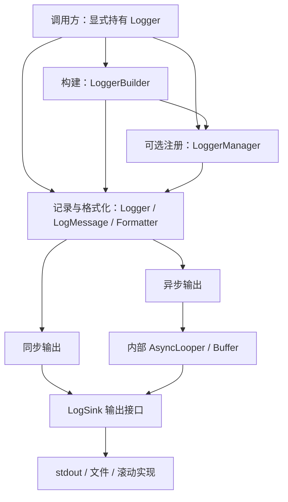

# zlog 架构审查与重构方案

审查日期：2026-10-09。

本文记录实施前的架构审查、验证结果和目标方案。本轮没有修改生产代码、测试代码或构建配置。下文的删除、移动和 API 调整均为拟实施方案，不表示迁移已经完成。

## 1. 审查结论

zlog 的主体设计可以保留：Logger 提供日志入口，Formatter 执行格式规则，LogSink 隔离输出目标，SyncLogger 和 AsyncLogger 提供不同执行方式。这些抽象有真实用途，不需要重新套用多层应用架构。

最值得重构的是以下边界：

1. 公共记录接口与构建、全局注册、异步实现混在一起。
2. 长期状态借用外部内存，异步资源使用不必要的共享所有权。
3. 字节长度在格式化和输出边界丢失。
4. 异步完成、关闭和错误传播没有稳定的公共契约。
5. 注册表持锁销毁对象，导致锁与线程生命周期交叉。
6. ModuleLogger 混入上层初始化策略，且已经没有生产调用者。

本项目适合采用“记录与格式化、输出、异步执行、构建与可选注册”四个职责边界。目标是让依赖和所有权清晰，而不是增加更多接口层或类。

## 2. 范围与验证依据

已完整阅读：

- zlog 的 10 个头文件、9 个实现文件。
- 全部单元测试、集成测试、性能程序和性能脚本。
- zlog README、模块 CMake，以及仓库公共构建、测试、安装 helper。
- 仓库其他模块中的 zlog 引用和实际生产调用方。

未将其他模块的全部实现作为本次审查范围。跨模块结论依据引用搜索、构建声明及相关调用链。

验证在仓库外的临时目录中执行：

| 验证 | 结果 |
|---|---|
| 独立 Debug 配置与构建 | 成功，Clang 21.1.8、共享库、系统 allocator |
| zlog CTest | 9/9 测试目标通过 |
| 测试用例数量 | 单元测试 136 个、集成测试 16 个，共 152 个 |
| 无零终止数据输出 | AddressSanitizer 确认越界读取 |
| Buffer 拷贝 | AddressSanitizer 确认重复释放 |
| ModuleLogger 销毁后访问名称 | AddressSanitizer 确认 use-after-free |
| 格式串尾部、时间缓存、内嵌 NUL、文件错误 | 最小复现确认 |
| 注册表替换与异步回调 | 受控复现发生死锁，3 秒超时后终止 |

基线构建和测试命令如下，`<review-dir>` 是仓库外的临时目录：

```bash
cmake -S zlog -B <review-dir>/build -G Ninja \
  -DCMAKE_CXX_COMPILER=clang++ \
  -DCMAKE_BUILD_TYPE=Debug \
  -DBUILD_TESTING=ON \
  -DBUILD_SHARED_LIBS=ON \
  -DZLYNX_BUILD_PERF_TESTS=OFF \
  -DZLYNX_USE_ZMALLOC_OVERRIDE=OFF
cmake --build <review-dir>/build -j 4
ctest --test-dir <review-dir>/build --output-on-failure -j 2
```

本轮未执行整个 zlynx 的构建、ThreadSanitizer、性能对比或安装消费测试。ASan 验证针对最小复现，没有对全部测试运行 ASan。历史覆盖率报告不作为当前源码覆盖率结论。

## 3. 当前项目的目标与运行模型

### 3.1 核心目标与跨模块位置

zlog 是一个 C++17 日志基础设施库，核心能力是级别过滤、正文格式化、pattern 格式化、同步或异步输出、多 sink 及文件滚动。

它没有独立主程序，也没有 HTTP、网络传输或业务存储职责。文件输出属于 sink；模块不需要额外的 Application、Domain 或 Service 层。

当前生产依赖为：

```text
zhttp runtime → zlog → fmt / Threads
znet → zco
```

zco、znet 的生产源码已经没有 zlog 引用。zhttp 使用每实例 SyncLogger，不注册全局 logger、不创建日志线程，见 [runtime/logging.cc](../../zhttp/src/runtime/logging.cc)。zlog 不反向包含上层模块。

源码树整体构建还可以通过根 CMake 的显式选项私有链接 zmalloc override；这是项目级 allocator 策略，不是 zlog 的业务依赖。

### 3.2 启动与控制流

局部 logger 的构建流程：

```text
创建 LoggerBuilder
→ 设置名称、级别、格式和执行方式
→ 创建 sink；文件 sink 此时创建目录、打开文件
→ build() 补充缺省 formatter 和 stdout sink
→ 创建 SyncLogger 或 AsyncLogger
→ AsyncLogger 创建 looper 和工作线程
```

全局入口增加了注册表访问。LoggerManager 首次使用时通过 Builder 创建 root logger；Builder 的 build_global() 又调用 LoggerManager 注册对象。这里存在装配职责回环，但没有递归调用 build_global() 的初始化路径。

ModuleLogger 的 init() 还调用外部依赖初始化函数，再创建异步 logger、替换注册表实例并更新自身缓存。日志封装因此参与了其他模块的启动控制。

### 3.3 数据流与线程模型

```text
调用线程
  级别过滤
  → fmt 格式化正文
  → 捕获时间、线程 ID、源码位置和 logger 名称
  → Formatter 生成最终字节
  ├─ SyncLogger：持有 logger 锁，依次输出到 sink
  └─ AsyncLogger：复制到生产缓冲区
       → 工作线程交换缓冲区
       → 整批输出到 sink
```

异步模式将 I/O 移到后台，格式化仍在生产线程完成。这个分工合理，应保留。

每个 AsyncLogger 创建一个工作线程和两个默认各 2 MiB 的缓冲区。消费触发条件为达到 64 KiB 阈值、等待超时或停止。

SAFE 模式使用固定容量并阻塞等待空间；UNSAFE 模式允许扩容，但到达限制后仍会等待。UNSAFE 不表示没有同步，也不保证非阻塞。

### 3.4 生命周期与资源所有权

| 对象或资源 | 当前所有权 |
|---|---|
| logger 名称 | Logger 和 Builder 保存非拥有的 const char* |
| 格式化器 | Builder 与 logger 通过 shared_ptr 共享 |
| sink | Builder、logger、调用方可通过 shared_ptr 共享 |
| looper | AsyncLogger 使用 shared_ptr，实际没有其他拥有者 |
| 缓冲区内存 | Buffer 手工 malloc/realloc/free，但允许默认浅拷贝 |
| 工作线程 | AsyncLooper 创建并在 stop()/析构中 join |
| 文件流 | 文件 sink 持有并随对象析构释放 |
| 全局 logger | 注册表持有 shared_ptr，通常持续到进程退出 |
| 日志消息视图 | 借用外部字符串和线程本地缓冲区 |

当前正常析构顺序中，AsyncLogger 的 looper 成员先析构，之后才析构基类中的 sinks，因此工作线程通常会先退出。这一点本身正确；需要改进的是让关系显式，并提供可观察的完成与关闭入口。

### 3.5 配置、错误和公共设施

配置主要发生在构建期，没有独立配置文件系统。ModuleLogger 的重初始化通过创建并替换实例实现，不是对现有 logger 的原子配置更新。

错误处理不一致：Formatter 对错误规则抛异常，looper 对超长消息和停止后提交抛异常，文件目录与流错误缺少可靠检查；后台 callback 的异常存入 looper，只在显式 stop() 时重新抛出。AsyncLogger 没有暴露 stop()，析构会吞掉这些异常。

公共 util 同时包含文件系统工具、NonCopyable 和自旋锁。它们属于不同职责，没有必要形成统一工具模块。

## 4. 架构问题与优先级

### 4.1 公共接口和实现边界混合

[logger.h](../include/zlog/logger.h) 同时包含 Logger、SyncLogger、AsyncLogger、LoggerBuilder、LoggerManager。它直接包含 internal/looper.h，向所有消费者传递 Buffer、Spinlock、条件变量和线程实现。

internal 头文件仍被安装，类型也处于 zlog 命名空间；公共声明直接出现 Buffer 和 AsyncLooper。目录名没有形成真正的实现边界。

建议分离构建、注册公共头，并用前置声明和独占实现对象隐藏异步资源。保留 Logger 及同步/异步记录器在同一个公共头中，不因类数量机械拆文件。

### 4.2 长期状态的所有权不清晰

Logger 和 Builder 不拥有名称。ModuleLogger 传入 name_.c_str() 后，注册表中的 logger 可以比 ModuleLogger 活得更久，导致名称悬空。

Buffer 的析构负责释放内存，却没有禁止复制；AsyncLooper 使用共享指针，也没有实际共享需求。

建议名称按值持有，Buffer 禁止拷贝，worker 使用 unique_ptr。shared_ptr 继续用于实际存在多方引用的 logger 和 sink，不要求全部改成独占所有权。

### 4.3 注册表与线程生命周期交叉

[upsert_logger()](../src/logger.cc) 在注册表锁内替换 shared_ptr。若旧实例的最后一个引用被释放，操作会在锁内执行 AsyncLogger 析构和工作线程 join。

已复现以下等待环：

```text
替换线程持有注册表锁
→ 销毁旧 AsyncLogger
→ 等待旧工作线程退出
→ 工作线程的 sink 回调查询注册表
→ 等待注册表锁
```

修正原则是锁内只修改映射，锁外释放旧对象。root 的读写也必须使用一致的同步方式。

### 4.4 缺少完成和错误传播接口

AsyncLogger 不能显式等待既有日志输出完成、关闭提交或获取后台错误。应用和测试只能依赖析构或固定 sleep。

应定义 Logger 层的完成契约，并区分“请求被接收”“sink 输出完成”“流被刷新”。现有实现没有磁盘同步保证，不能将流刷新描述为持久化保证。

### 4.5 sink 共享没有线程安全契约

多个 logger 可以共享同一 sink；重复调用同一个 Builder 的 build() 也会复用 sink。SyncLogger 的锁只保护自身，AsyncLogger 的单消费者只保护自己的工作线程。

FileSink 和 RollBySizeSink 没有保护共享文件流、计数器和滚动状态。建议内置 sink 自行同步，并明确自定义 sink 的共享契约。此结论来自源码和所有权分析，本轮未使用 TSan 验证。

### 4.6 ModuleLogger 的职责与隐式依赖

[ModuleLogger](../src/module_logger.cc) 同时负责级别过滤、缓存、全局注册、重初始化、线程创建及依赖初始化。级别与 Logger 重复，缓存与注册表重复，多次并发初始化也没有形成一个完整的同步事务。

仓库内已经没有生产调用者，只有自身测试。建议删除，将模块 logger 的创建和依赖初始化放回应用装配边界。

### 4.7 可以保留的设计

未发现 zlog 头文件包含循环、对上层模块的反向源码依赖、深层继承树或网络业务混入。

LoggerManager 本身是小型注册表，不是万能管理器。Logger 的过滤、记录构造、格式化和派发可以组成一个清晰职责。两种 Logger 和多种 sink 的继承关系有实际替换需求；Formatter 的格式项值设计也比碎片格式项类更简单。

## 5. 已确认的正确性问题

以下问题需要随架构迁移修正，不能作为必须兼容的正常业务行为保留。

| 问题 | 当前行为与验证 | 推荐行为 |
|---|---|---|
| 输出越界读取 | 内置 sink 使用 fmt 的 C 字符串精度格式输出；StdOutSink 接收 3 字节无零终止数据时，ASan 报 strlen 越界 | 按指定长度输出字节，不依赖零终止 |
| 内嵌 NUL 丢失 | 日志正文和 FileSink 的 a\\0b，长度 3，实际输出长度 1 | 格式化、消息视图和 sink 全链路保留长度 |
| 名称悬空 | ModuleLogger 销毁后访问仍存活 logger 的名称，ASan 报 use-after-free | Logger 自己拥有名称 |
| Buffer 重复释放 | Buffer b = a 后析构，ASan 报 double-free | 禁止复制，明确内存唯一所有权 |
| pattern 尾部丢失 | literal 输出为空，%m suffix 输出只有正文 | 解析结束时保存剩余普通文本 |
| 时间缓存键缺失 | 同一秒先格式化年份，再格式化月份，月份仍输出年份 | 缓存包含格式身份，或先移除缓存 |
| 文件错误未报告 | /dev/null/zlog.log 构造和写入没有报告错误 | 检查目录创建、打开、写入和刷新结果 |
| 后台错误不可观察 | throwing sink 被调用，但 AsyncLogger 结束后没有向调用方报告错误 | 显式完成操作传播后台失败 |
| 注册表替换死锁 | 锁内销毁旧异步 logger，其 sink 回调查询注册表，受控复现超时 | 锁外释放旧实例 |

主要证据：[sink.cc](../src/sink.cc)、[buffer.h](../include/zlog/internal/buffer.h)、[format.cc](../src/format.cc)、[logger.cc](../src/logger.cc)、[module_logger.cc](../src/module_logger.cc)、[looper.cc](../src/looper.cc)。

另外两处由静态分析发现，尚未执行完整运行时验证：

- root_logger() 无锁读取 shared_ptr，而 upsert_logger() 可以修改它，存在数据竞争条件。
- 容量判断不一致：空 Buffer 的 can_accommodate(kMaxBufferSize) 返回 false，但 AsyncLooper 接受这个长度进入等待；ensure_enough_size() 的无法扩容路径还可能返回后继续 memcpy。需要统一容量判断、溢出检查和扩容失败规则。

## 6. 目标架构



箭头表示逻辑调用与依赖，不表示每个节点都需要新建一个类或构建目标。

| 模块 | 职责 | 允许依赖 | 禁止依赖 |
|---|---|---|---|
| 消息与格式化 | 日志级别、记录视图、pattern 解析和执行 | 标准库、fmt | 注册表、线程队列、文件操作、上层模块 |
| Logger | 过滤、正文格式化、元数据捕获、派发 | 消息、Formatter、输出接口 | 全局注册、上层初始化 |
| 异步实现 | 接收字节、背压、排空、关闭、线程资源 | 内部 Buffer、同步原语、输出接口 | Builder、注册表、业务模块 |
| sink | 按长度输出、文件资源和滚动 | 标准库、文件系统、输出设施 | Logger、Builder、注册表 |
| Builder | 收集配置、校验并构建 logger | Logger、formatter、sink、可选注册接口 | 业务模块初始化 |
| 注册表 | 命名 logger 的保存、查询和替换 | Logger 句柄、同步原语 | Builder、异步实现细节、业务模块 |

局部 logger 应能完全绕过注册表。注册表存取逻辑只处理 Logger 句柄；默认 root 的装配属于可选全局入口，注册表本身不再使用 Builder 初始化。

保留 zlog::zlog 构建和安装目标。不因职责分离立即拆成多个库，也不新增配置系统、通用线程池、网络 sink 或其他未要求的能力。

### 6.1 核心对象关系与所有权

```text
应用 / 可选注册表
  └─ Logger 句柄
      ├─ 自有名称字符串
      ├─ 固定格式规则
      ├─ sink 句柄：允许真实共享，遵守同步契约
      └─ AsyncLogger 独占 worker
          ├─ 工作线程
          └─ 两个不可拷贝缓冲区
```

记录视图在调用线程格式化期间借用正文与元数据。异步队列只保存已经复制的自有字节，不保存调用方指针。

文件流继续由 sink 持有；先结束异步 worker，再释放输出资源。注册表操作不在锁内关闭、销毁或调用外部对象。

### 6.2 数据流与关闭契约

```text
级别过滤
→ 按长度格式化正文
→ 捕获时间、线程和源码位置
→ 执行 pattern
→ 同步输出 / 复制后入队
→ sink 输出
→ 完成或报告错误
```

拟定义：

- flush()：等待调用前已接收的数据完成输出，并刷新 sink；不能依赖固定等待时长。
- close()：停止接收、唤醒等待者、排空已接收数据、join，再报告后台错误；明确重复关闭行为。
- 析构：执行不抛异常的资源回收；应用需要检查输出结果时显式完成或关闭。
- 输出失败：明确是否继续尝试其他 sink、何时报告失败；不在重构中添加隐式重试或递归日志。

保留当前“一 logger 一工作线程”和“生产线程格式化”的执行方式。滚动仍按现有写入块语义工作，不在本轮偷偷改成逐条滚动或严格文件大小上限。

### 6.3 每个核心类型的处理

| 类型 | 一句话职责 | 处理 |
|---|---|---|
| Logger | 过滤并格式化日志，然后派发 | 保留；收紧内部状态访问 |
| SyncLogger | 在调用线程完成日志输出 | 保留 |
| AsyncLogger | 接收日志并管理异步输出生命周期 | 保留；组合独占 worker |
| Formatter | 编译并执行 pattern | 保留具体类和格式项值；不增加格式项继承体系 |
| LogMessage | 表示一次格式化期间有效的记录视图 | 保留值对象；明确长度和借用有效期 |
| LogSink | 提供可替换、可测试的字节输出接口 | 保留 |
| 内置三种 sink | 分别输出到 stdout、文件、滚动文件 | 保留；自行保护可共享状态 |
| LoggerBuilder | 收集参数并构建 logger | 保留；从核心头中分离 |
| LoggerManager | 保存和查找命名 logger | 保留名称；独立模块，修正锁范围 |
| ModuleLogger | 现有模块日志初始化与缓存封装 | 删除，无生产调用者且职责交叉 |
| Buffer | 独占异步字节存储 | 保留内部 RAII 类型，禁止拷贝 |
| File | 为文件 sink 提供文件操作 | 合并为 sink 内部普通函数或标准库调用 |
| NonCopyable | 通过继承禁止复制 | 删除，用类型自身的删除声明表达 |
| Spinlock | 提供异步内部同步 | 隐藏到异步模块，先不调整锁算法 |
| LogLevel | 表达日志级别及文本转换 | 保留现有公共形式，改名收益不足 |

参数数量本身不是首要问题。现有 sink 构造参数较少，不需要为了消除 bool 参数增加配置类；应明确刷新语义。Formatter、Builder 和 final sink 中仅服务实现的 protected 状态应收紧，而不是增加 getter/setter。

## 7. API 与兼容性计划

以下仅为计划，没有实际删除或修改 API。

| 类别 | 拟调整 |
|---|---|
| 删除 API | ModuleLogger、DependencyInitializer；默认头中的无前缀 DEBUG/INFO/WARN/ERROR/FATAL 宏 |
| 移出安装接口 | Buffer、AsyncLooper、File、Spinlock、NonCopyable 及其内部头 |
| 修改输入和存储 | 名称由对象复制持有；sink 列表取消无意义可变引用；消息正文保留长度 |
| 新增完成接口 | Logger 的 flush()/close()、sink 的刷新能力、明确的注册结果 |
| 注册行为调整 | 建议 build_global() 重名时返回实际注册实例，继续保持不替换规则 |
| 头文件调用方式 | 直接使用 Builder、注册表的代码包含各自头；zlog.h 继续提供聚合入口 |
| 保留 API | Logger、SyncLogger、AsyncLogger、Formatter、LogSink、Builder 的主要用法；ZLOG_* 源码位置宏 |
| 命名空间 | 公共类型继续使用 zlog；内部实现移入 zlog::detail |

build_global() 目前在重名时返回新建实例，但注册表保留旧实例。现有测试明确锁定了这个行为。修改为返回实际注册实例属于需要记录、测试和发布说明的行为调整，不能作为纯内部优化处理。

保留全局注册和 root 便利入口不会损害核心架构，只要它们是可选依赖。查询不存在时，注册表返回空与便利入口抛异常可以保留，但文档必须分别说明。

仓库内生产调用方主要为 zhttp/runtime/logging.cc，以及 zlog 的测试和性能程序。仓库外消费者未知。若实际修改公共布局或删除上述 API，应升级 ABI 主版本并验证安装消费；不为了重构而改名整个公共接口。

## 8. 目录与文件迁移计划

建议完整的 zlog 目录如下；这是目标结构，尚未实施。仓库其他模块目录不在迁移范围。

```text
zlog/
├── CMakeLists.txt
├── README.md
├── docs/
│   ├── architecture-review.md
│   └── architecture.md
├── include/
│   └── zlog/
│       ├── zlog.h
│       ├── logger.h
│       ├── logger_builder.h
│       ├── logger_registry.h
│       ├── level.h
│       ├── message.h
│       ├── format.h
│       └── sink.h
├── src/
│   ├── logger.cc
│   ├── async_logger.cc
│   ├── logger_builder.cc
│   ├── logger_registry.cc
│   ├── level.cc
│   ├── message.cc
│   ├── format.cc
│   ├── sink.cc
│   └── async/
│       ├── looper.h
│       ├── looper.cc
│       ├── buffer.h
│       └── buffer.cc
└── tests/
    ├── CMakeLists.txt
    ├── support/
    │   └── test_files.h
    ├── unit/
    │   ├── logger_test.cc
    │   ├── logger_builder_test.cc
    │   ├── logger_registry_test.cc
    │   ├── level_test.cc
    │   ├── format_test.cc
    │   ├── sink_test.cc
    │   ├── looper_test.cc
    │   └── buffer_test.cc
    ├── integration/
    │   └── zlog_integration_test.cc
    └── benchmark/
        ├── zlog_benchmark.cc
        ├── zlog_performance.cc
        └── zlog_perf.sh
```

| 旧位置 | 目标位置或处理 |
|---|---|
| logger.h/logger.cc 中的 Builder | logger_builder.h/logger_builder.cc |
| logger.h/logger.cc 中的注册表 | logger_registry.h/logger_registry.cc |
| logger.cc 中的异步实现 | async_logger.cc |
| include/zlog/internal/{buffer,looper}.h | src/async/ |
| src/{buffer,looper}.cc | src/async/ |
| internal/util.h、util.cc | 文件操作并入 sink；锁归入异步内部；删除剩余空壳 |
| module_logger.h、module_logger.cc | 删除 |
| module_logger_test.cc | 删除；真实注册与生命周期行为由对应测试验证 |
| util_test.cc | 文件行为并入 sink_test.cc |
| 多份测试文件操作 | tests/support/test_files.h |

不拆分体积较小且职责相关的三个 sink，不为简短的值对象实现机械合并或增加类。目标目录根据实际修改责任划分，而不是追求目录层数。

## 9. 实施顺序与验收条件

| 阶段 | 调整 | 验收 |
|---|---|---|
| 1 | 分离构建、注册公共接口；隐藏异步头；修正依赖方向 | 公共头独立编译；核心不包含注册或内部缓冲头；构建和现有测试通过 |
| 2 | 名称自有存储、Buffer 禁止复制、worker 独占 | 名称生命周期与复制约束测试；ASan 复现不再失败 |
| 3 | 输出长度、格式串和时间缓存、文件错误检查 | 精确字节与错误路径测试；同步/异步集成测试通过 |
| 4 | flush/close、后台错误传播、锁外释放旧实例、sink 同步契约 | 真实背压、关闭竞争、后台失败、共享 sink、替换死锁测试；适用时运行 TSan |
| 5 | 删除 ModuleLogger 和工具空壳；更新调用方、目录、文档及构建 | zlog 与 zhttp 调用方验证；完整仓库构建测试；安装消费验证 |

每完成一个主要模块都编译并运行 zlog 现有测试；公共接口改变时立即核对调用方。迁移完成后删除旧实现，不保留 Old/New/V2/Legacy 双轨结构。

最终应满足：

1. 公共接口不暴露队列、锁和缓冲实现。
2. 日志名称、缓冲内存、线程和文件资源的拥有者明确。
3. 有长度的数据按长度通过整个日志链路。
4. 异步接收、背压、完成、关闭和错误有可测试契约。
5. 注册表锁不覆盖对象析构、线程等待或外部回调。
6. 局部 logger 不触发全局初始化。
7. 新输出目标只影响 sink，格式规则只影响 Formatter，排队策略只影响异步内部。

## 10. 测试与性能结论的限制

现有测试覆盖了基本功能，但全部通过不等于边界正确。部分异步测试仅检查非空、计数大于零或直接 SUCCEED()；固定 sleep 也不能证明数据完成输出。

必要补充包括：精确字节输出、动态名称生命周期、不同时间格式、容量边界、真实背压、完整多线程输出、显式完成、共享 sink、后台失败与注册表替换。文件测试应使用独立临时目录，异步测试应使用完成条件而不是延长 sleep。

当前性能程序不能直接用于判断同步与异步架构优劣：

- 同步开启 auto_flush，异步关闭，输出策略不同。
- 异步结束计时早于排空和关闭。
- 平均延迟由总吞吐量倒数计算，没有实际测量单次调用延迟。
- 部分 benchmark 在日志资源仍存活时清理输出目录。

应先统一输出策略和完成语义，再分别报告提交耗时与完整输出耗时。架构重构不同时调整锁算法、缓存和预热等性能策略；性能收益需要新的可比较数据。

## 11. 本轮交付状态

本轮完成架构审查、独立构建与现有测试、针对性最小复现，并输出本报告。没有删除 API、移动生产文件、修改命名空间或实现新架构。

值得继续实施的工作集中在上述边界与正确性问题。完成后，新开发者应能直接判断：格式行为属于 Formatter，输出行为属于 sink，排队与关闭属于异步模块，名称查找属于可选注册表，模块初始化属于应用装配代码。
