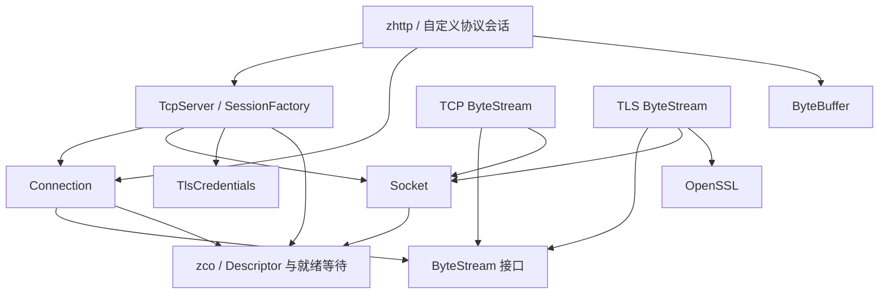

# znet 3 架构重设计（C++17，Breaking Changes）

## 范围与成功条件

仓库由 zmalloc（分配器）、zlog（日志）、zco（协程执行/等待）、znet（网络传输）、
zhttp（HTTP/WebSocket 协议与业务分发）组成。重设计范围是整个 znet 及其全部调用方；
不重写不相关的分配器、日志、协程调度或 HTTP 路由/中间件。
已扫描仓库文件、构建目标、模块 include 依赖，通读 znet 全部实现、公开接口、测试及
HTTP/WebSocket 网络接入路径。修改前 Debug 构建成功，74/74 CTest 测试通过。

成功条件：C++17 全项目编译；TCP/UDP、IPv4/IPv6/Unix 地址、域名解析、TLS、
并发发送、部分写入、关闭/取消、读写/空闲/请求截止时间、HTTP/WebSocket 保持可用；
所有调用方迁移；关键模块有无需真实网络的测试；旧实现删除；安装包可以独立使用。

## 现状评估（按严重程度）

| 优先级 | 证据 | 架构后果与处理 |
|---|---|---|
| P0 | TcpServer 默认析构；Acceptor 回调捕获裸 this；连接任务持有服务器 shared_ptr | 无法通过对象所有权推断停止/销毁；改为 RAII 服务器及独立、按次启动的运行实例 |
| P0 | TLS 握手在 register_connection 之前；stop 不 join 连接任务 | 停止无法覆盖握手与尚未登记的任务；先登记再提交任务，stop 取消所有传输并等待任务完成 |
| P0 | TcpConnection::context 是 void*；zhttp 手动 new/delete shared_ptr | 类型和释放责任泄漏；会话工厂返回闭包，协议状态由闭包持有 |
| P0 | send/flush 多次生成相对超时；部分写入可能最终返回完整 length | 发送结果失真、预算可能延长；每次操作只有一个绝对截止时间，返回 bytes/error/eof |
| P1 | TcpConnection 混合 Buffer、Socket、TLS、邮箱、执行器、状态、回调、配置 | God Class；拆为 Connection 传输契约、ByteStream 边界、TCP/TLS 实现及服务会话 |
| P1 | Buffer 调用 Socket 和 zco IO；HTTP 读取 socket()/output_buffer() | 层次污染与 Feature Envy；ByteBuffer 为纯数据结构，上层仅使用连接元信息和发送结果 |
| P1 | ConnectionActor 顺序执行读写；读挂起时发送无法推进 | 单连接读写被不必要地绑定；分别串行化读与写，TLS 仅在 OpenSSL 调用期间互斥 |
| P1 | errno/bool/int/nullptr/可选错误输出/日志后忽略混用 | 统一 Result<T>、Error 和 Transfer；低层只传播，服务边界向注入的错误回调报告一次 |
| P1 | connections 以可复用 fd 为键，状态/地址缓存多份 | 连接身份与 OS 资源混同；运行实例用递增会话 id，端点直接查询、配置冻结 |
| P1 | start/stop 的 CAS 不覆盖 socket、配置和任务表；运行中可以改回调 | 原子标志不能保障完整生命周期；控制操作串行，配置构造后不可变 |
| P2 | Address/IPAddress/IPv4Address/IPv6Address/UnixAddress | 地址是值，无需虚函数/共享所有权/动态转换；合并为 Endpoint |
| P2 | 无效 IP 降级到 ANY；Unix 路径截断；Address::create 忽略长度 | 校验失败必须显式返回错误；保留精确 Unix 地址长度与抽象命名空间 |
| P2 | Acceptor 与 TcpServer 均有 running/socket/任务/生命周期 | 碎片化同一职责；接入循环归服务器运行实例，Socket 仍提供底层 accept |
| P2 | TlsContext 仅一个后端；TlsChannel 要求上层注入等待函数 | 虚假后端工厂与 TLS IO 泄漏；TLS 凭据为资源对象，等待在 TLS ByteStream 内实现 |
| P2 | NonCopyable 继承、callbacks.h 重复回调别名、多个转发函数 | 删除无意义继承、包装和分散定义；使用 =delete、就近定义接口 |
| P2 | 高水位按发送长度触发，输出队列可由外部任意修改 | 不是实际背压；取消该回调和输出队列，发送同步返回进度，本身提供背压 |
| P2 | 全局模块日志与 OpenSSL 初始化对象 | 网络库不需要 ServiceLocator/全局日志；移除 zlog 依赖，OpenSSL 按需初始化 |
| P2 | 大量 private-public 测试，甚至读取已经释放的 FakeTlsChannel | 实现耦合、测试自身有悬空访问；换成公开契约、假 ByteStream 和真实网络集成测试 |

跨库 include 依赖不存在 znet→zhttp 或 zco→znet 环；不能把问题表述为已有模块循环。
现有主要问题是类内部高度耦合、依赖具体 Socket、上下层边界泄漏和修改传播。
zmalloc/zlog 的内部工具类不属于本次范围。重构不会给它们增加新的清理修改。

## 目标边界与依赖



实现方向：服务/会话 → Connection → ByteStream；TCP/TLS 基础设施实现 ByteStream。
ByteBuffer 只依赖标准库。Endpoint/Error 是值模型。Socket 不依赖 Connection/Server/Buffer。
网络库不持有业务协议对象、不访问全局运行时、不提供共享杂物 context。
ByteStream 的多态有 TCP、TLS、假传输三个实际使用者；不增加额外工厂接口或 manager。

| 模块 | 唯一目标 | 不承担的职责 |
|---|---|---|
| endpoint | 校验并表达端点；配置阶段解析域名 | fd、连接状态、日志 |
| byte_buffer | 保存并消费增量协议字节 | 网络 IO、调度、协议解析 |
| error | 结构化失败及传输进度 | 错误处理策略、日志 |
| transport / ByteStream | 稳定的字节传输契约 | 会话回调、业务状态、输出队列 |
| transport / Socket | 非阻塞系统资源与就绪等待 | TLS、服务器生命周期、协议 |
| transport / TLS | 凭据和加密传输 | 业务会话和公开 OpenSSL 类型 |
| server / Connection | 传输生命周期、独立读写串行化、操作预算 | 协议状态、输入所有权、服务器登记 |
| server / TcpServer | 接入、会话创建、取消与任务收敛 | HTTP/WS、运行时所有权、全局日志 |
| zhttp | HTTP/WS 解析、协议切换和业务分发 | Socket/TLS 实现和网络内部缓冲 |

### 数据流

监听 Socket → accept → 创建唯一传输 → 创建共享连接句柄 → 登记会话 → 提交任务 →
传输 start（TLS 握手）→ 会话工厂 → ByteBuffer 增量读取 → 会话回调消费/响应 →
传输关闭 → 关闭回调 → 回收完成任务。

TCP/TLS 都经过同一 Connection 的 read/send 契约。send 不维护隐藏队列，逐次 write_some
汇总真实进度。一次调用的截止时间覆盖排队、重试和所有部分写入，失败后调用者知道精确进度。
TLS 调用与 fd 借用同时受保护，关闭后不会误操作已经复用的 fd；等待时释放 TLS 互斥锁。

### 生命周期与 ownership

| 对象 | 创建/拥有/销毁 | 共享与空值 |
|---|---|---|
| Runtime | 应用创建并拥有，最后销毁；服务器仅借用 | 可以供多个服务器使用；引用不可空 |
| TcpServer | 应用以栈或 unique_ptr 拥有；析构请求停止并收敛任务 | 无 shared_from_this 要求 |
| 每次启动的运行实例 | 服务器与该次 accept/session 任务共享 | 真实共享寿命；新一轮启动不会复用旧状态 |
| 会话登记项 | 运行实例的 map 按值唯一拥有，stop 转移到局部 map 后等待销毁 | 不使用 shared_ptr；只保存连接句柄和任务句柄 |
| Socket/Descriptor | 值/RAII，传输唯一拥有 fd；移动转移所有权 | 不共享 Socket，不提供 raw close/reconnect 路径 |
| ByteStream | Connection 的 unique_ptr | 必须非空；析构释放全部资源 |
| Connection | 服务会话与实际异步使用者共享，协议使用 weak_ptr | shared_ptr 仅用于有独立寿命的连接句柄；不反向拥有服务器 |
| ByteBuffer | 单个会话任务的局部对象，协议借用 | 无 IO/锁/运行时依赖；同一缓冲不允许并发读写 |
| TLS 凭据 | 显式加载，不可变配置，可被多个服务器共享 | 可选 shared_ptr<const TlsCredentials>；OpenSSL 状态由 RAII 释放 |
| 协议状态 | SessionFactory 生成的闭包持有 | 不再存入连接 void*；最后一个闭包销毁时释放 |

start/stop 是控制线程操作。业务回调调用 request_stop（不等待自己的任务）；控制线程调用
stop 等待 accept 和全部会话结束。服务器在自己运行时的回调内析构时只请求停止，运行实例由
任务保持到安全结束。Connection close 直接撤销 Descriptor，唤醒读/写/握手，不排入 IO 队列。
Connection 普通线程调用通过显式注入的 executor 提交单次操作并 join；协程内直接执行。
不保留 mailbox、inline actor 或 shared_from_this。读写各自互斥，关闭不等待互斥锁。

## 完整目标目录（znet）

```text
znet/
├── CMakeLists.txt
├── README.md
├── docs/
│   ├── architecture-redesign.md
│   └── refactor-validation.md
├── include/znet/
│   ├── error.h
│   ├── endpoint.h
│   ├── byte_buffer.h
│   ├── transport/
│   │   ├── byte_stream.h
│   │   ├── socket.h
│   │   └── tls_credentials.h
│   └── server/
│       ├── connection.h
│       └── tcp_server.h
├── src/
│   ├── error.cc
│   ├── endpoint.cc
│   ├── byte_buffer.cc
│   ├── transport/
│   │   ├── socket.cc
│   │   ├── tcp_stream.cc
│   │   └── tls_stream.cc
│   └── server/
│       ├── connection.cc
│       └── tcp_server.cc
└── tests/
    ├── CMakeLists.txt
    ├── support/
    │   └── network_fixture.h
    ├── unit/
    │   ├── error_test.cc
    │   ├── endpoint_test.cc
    │   ├── byte_buffer_test.cc
    │   └── connection_test.cc
    ├── integration/
    │   ├── socket_test.cc
    │   ├── connection_io_test.cc
    │   ├── tcp_server_test.cc
    │   └── tls_stream_test.cc
    └── benchmark/
        ├── znet_wrk_benchmark.cc
        └── znet_wrk_perf.sh
```

## 迁移/删除清单

| 旧类型/功能 | 最终去向 |
|---|---|
| Address + IPAddress + IPv4Address + IPv6Address + UnixAddress | Endpoint 值对象；lookup → resolve_endpoints 普通函数 |
| Buffer | ByteBuffer；read_from_socket/write_to_socket 删除，IO 归 Connection |
| Socket shared_ptr 工厂与无效构造、reconnect、地址缓存、非阻塞切换 | move-only Socket + Result 工厂；保持非阻塞不变量，选项按值返回 |
| TcpConnection + ConnectionActor | Connection；删除邮箱，读/写分别串行化 |
| Acceptor + TcpServer 接入管理 | TcpServer 每次启动的运行实例；删除公开 Acceptor |
| TlsContext + OpenSslServerTlsContext + TlsChannel | TlsCredentials + TLS ByteStream；删除上层 WaitCallback |
| callbacks.h | SessionCallbacks/SessionFactory 定义在 tcp_server.h |
| NonCopyable | 删除，资源类型明确 =delete |
| znet_logger.h/.cc 及宏、init_logger/get_logger_ptr/should_log | 全部删除；服务注入 on_error，zhttp 在应用边界记录 |
| context/set_context、input_buffer/output_buffer/flush_output、send_internal 等 | 全部删除；缓冲属于会话，协议闭包持有状态，发送结果直接判断 |
| 写完成/高水位回调、历史超时 sentinel、kConnecting/kDisconnecting | 删除；同步操作结果、明确的 Deadline、启动/对端 EOF/关闭状态替代 |

删除的旧生产文件如下，全部有明确替代或职责删除，不留兼容头文件：

```text
include/znet/address.h                src/address.cc
include/znet/buffer.h                 src/buffer.cc
include/znet/socket.h                 src/socket.cc
include/znet/acceptor.h               src/acceptor.cc
include/znet/tcp_connection.h         src/tcp_connection.cc
include/znet/tcp_server.h             src/tcp_server.cc
include/znet/tls_context.h            src/tls_context.cc
include/znet/znet_logger.h            src/znet_logger.cc
include/znet/internal/connection_actor.h   src/connection_actor.cc
include/znet/internal/noncopyable.h
include/znet/callbacks.h
```

现有 znet unit/integration 测试按新公开契约重写，旧 actor/acceptor/logger 专属测试删除。
迁移 zhttp 的网络启动、HTTP/WS 传输、前置声明、解析器缓冲类型、相关测试和 benchmark；
迁移根构建标准和文档。没有 adapter、别名兼容层、两套实现或遗留 TODO。
HTTP 的驱动/关闭重入标志随旧回调模型删除；会话回调在同一任务内依次执行，
异常交由服务边界处理。协议切换仍延迟到当前回调返回后，避免销毁正在执行的协议对象。

### 破坏性变化

- API/类：删除地址多态、Acceptor、TcpConnection、TlsContext/TlsChannel、网络全局日志。
- include/目录：按 endpoint、字节数据、transport、server 划分；旧 include 不再存在。
- namespace：公共仍使用 znet；删除公开 znet::detail actor 及 NonCopyable。
- 构造/ownership：地址按值；Socket 可移动不可复制；Connection 唯一拥有 ByteStream；
  TcpServer 接收 Runtime&、Endpoint、SessionFactory、不可变 ServerOptions。
- 错误：运行/验证/IO/协议/应用错误返回结构化 Error；资源创建返回 Result；
  传输返回 Transfer（进度与错误并存）；错误访问 Result、空必要依赖等编程错误抛异常。
- 配置：超时使用 chrono::milliseconds；0 无限；Deadline 绝对时间；TLS 显式加载；
  构造后冻结；不默认启用 SO_REUSEPORT。
- 行为：stop 等待完整收敛；request_stop 可在回调调用；读写能够同时推进；
  发送在传输阶段失败后关闭连接并保留实际进度；EOF 后仍允许写，close 才释放 fd；
  on_close 在传输关闭后执行；非法地址不静默降级。
- 构建/ABI：C++17；znet/zhttp 主版本提升到 3；znet 不再公开依赖 zlog/OpenSSL 头文件。

## 验证策略与复核

纯单元测试覆盖缓冲空区/增长/自追加、端点校验/长度/Unix 抽象地址、结构化错误，
假传输覆盖部分写入、零进展、异常、截止时间复用、关闭与串行发送。
集成测试覆盖 TCP/UDP/Unix、零长度数据报、线程/协程发送、读写并行、关闭唤醒无限等待、
慢客户端超时、服务器重启/析构/共享运行时/回调异常/握手期间 stop，以及真实 TLS 往返。
全量 CTest 保留上层 HTTP/HTTPS/WebSocket 回归；补充安装包外部消费和发布构建。
最终检查循环依赖、旧 API 引用、ownership、状态重复、代码量与无需保留的抽象。

2026-10-09 的 wrk 验证定位并删除了协程 IO 入口的 std::function 临时分配：
执行策略由 connection.cc 的模块内模板函数实现，不增加公开接口或新类；
普通线程仍提交并 join，协程直接执行。压测结果和限制见 [重构验证](refactor-validation.md)。
